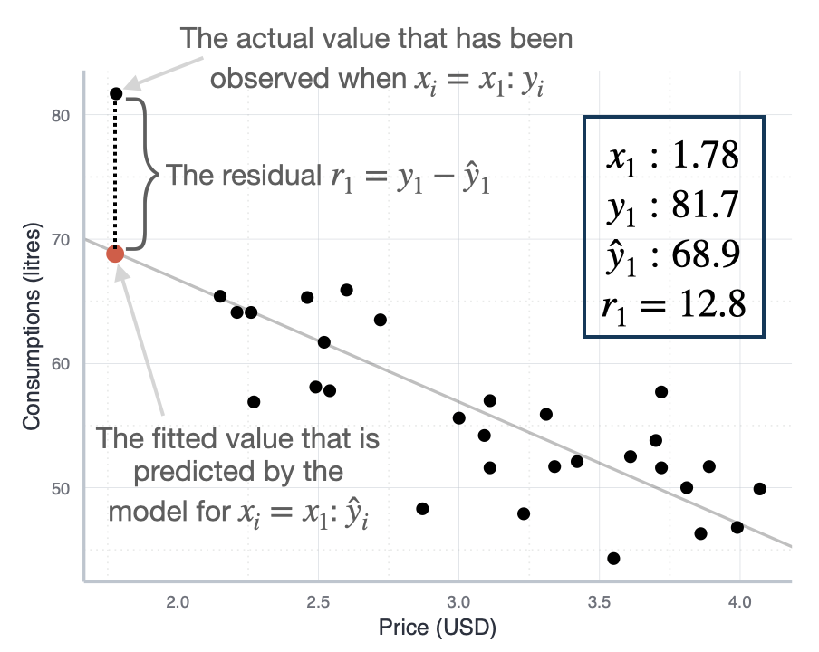

```{r}
#| code-summary: "R Packages Used"

library(ggplot2)
library(ggtext)
```


# Understanding Residuals: The Foundation of Diagnostics

Before diving into assumptions and diagnostic tests, we need to understand residuals—the cornerstone of all regression diagnostics. Many students confuse residuals with error terms, but understanding the distinction is crucial for interpreting diagnostic plots and tests.

## What Are Residuals?

**Residuals** are the observed differences between actual values and predicted values from your fitted model:

$$e_i = y_i - \hat{y}_i$$

where:

-   $e_i$ is the residual for observation $i$
-   $y_i$ is the actual observed value
-   $\hat{y}_i$ is the predicted value from your regression model

**In plain language:** A residual tells you how far off your prediction was for each observation. If your model predicts a customer will spend 100 EUR but they actually spent 120 EUR, the residual is 20 EUR (see also @fig-residuals).

```{r}
#| label: fig-residuals
#| fig-cap: "Illustration of a residual."
#| echo: false
#| out-width: "50%"


```


## Residuals vs. Error Terms: A Critical Distinction

Students often use "residual" and "error" interchangeably, but they are fundamentally different concepts:

| Concept | Symbol | What It Is | Can We Observe It? |
|----------------|----------------|----------------|-------------------------|
| **Error term** | $\epsilon_i$ | True, unknown deviation from the population regression line | **No** - it's a theoretical concept |
| **Residual** | $e_i$ | Observed deviation from our fitted sample regression line | **Yes** - we calculate it from our data |

**The error term** ($\epsilon_i$) is the true, unobservable deviation in the population model:

$$y_i = \beta_0 + \beta_1 x_i + \epsilon_i$$

This represents the "true" relationship in the population. We never observe $\epsilon_i$ because we don't know the true population parameters ($\beta_0$ and $\beta_1$).

**The residual** ($e_i$) is what we actually observe from our fitted sample model:

$$y_i = \hat{\beta}_0 + \hat{\beta}_1 x_i + e_i$$

This is our estimate based on sample data. We calculate $e_i$ because we have estimates $\hat{\beta}_0$ and $\hat{\beta}_1$.

## Why This Distinction Matters

1.  **Assumptions are about error terms, not residuals:** When we say "errors are normally distributed" or "errors have constant variance," we're making statements about the unobservable $\epsilon_i$ in the population.

2.  **Diagnostics use residuals to learn about errors:** Since we can't observe $\epsilon_i$, we use residuals $e_i$ as our best approximation. We examine residuals hoping they reveal the properties of the true errors.

3.  **Residuals are estimates of errors:** Under the regression assumptions, residuals should behave similarly to errors. If they don't (showing patterns, non-constant variance, etc.), it suggests the assumptions are violated.

## Types of Residuals in Diagnostics

You'll encounter several types of residuals in diagnostic output:

**1. Raw residuals** ($e_i$): $$e_i = y_i - \hat{y}_i$$

These are what we've been discussing—the basic difference between observed and predicted values.

**2. Standardized residuals** ($e_i^*$): $$e_i^* = \frac{e_i}{\hat{\sigma}\sqrt{1-h_i}}$$

where $\hat{\sigma}$ is the residual standard error and $h_i$ is the leverage. Standardized residuals have approximately unit variance, making them comparable across observations. Values beyond ±2 or ±3 suggest potential outliers.

::: {.callout-note icon=false collapse="true"}
## Understanding Leverage

**Leverage** (denoted as $h_i$ or "hat value") measures how unusual or extreme an observation's predictor values (X values) are compared to the rest of the data. It quantifies how far an observation is from the center of the predictor space.

**Key properties:**

- Leverage ranges from $\frac{1}{n}$ to 1
- Average leverage is $\frac{p}{n}$ where $p$ is the number of parameters (including intercept)

**Interpretation:**

- **Low leverage** ($h_i \approx \frac{p}{n}$): The observation's X values are typical, close to the center of the data
- **High leverage** ($h_i > \frac{2p}{n}$ or $\frac{3p}{n}$): The observation's X values are unusual or extreme

**Why leverage matters:**

High leverage observations have greater potential to influence the regression line because they're far from the center of the data.

However, **high leverage alone doesn't make a point influential**:

- If a high leverage point fits the model well (small residual), it reinforces the pattern and isn't problematic
- If a high leverage point doesn't fit the model (large residual), it can dramatically pull the regression line toward itself
:::

**3. Studentized residuals:**

Similar to standardized but use a different estimate of variance that excludes observation $i$. More robust for identifying outliers.

## Why Residuals Are Central to Diagnostics

Residuals are the empirical manifestation of all our modeling assumptions. Here's why they're so important:

**1. They reveal assumption violations:**

-   **Linearity:** If the relationship isn't linear, residuals will show systematic patterns (curves, waves)
-   **Homoscedasticity:** If variance isn't constant, residuals will spread out (or contract) across fitted values
-   **Normality:** If errors aren't normal, the distribution of residuals will deviate from normality
-   **Independence:** If observations aren't independent, residuals will show autocorrelation or clustering

**2. They're model-free diagnostics:**

Residuals don't require you to know the "true" model. They simply show you what's left unexplained after fitting your model. Large, systematic patterns in residuals mean your model is missing something important.

**3. They quantify model performance:**

The magnitude of residuals tells you about prediction accuracy. Ideally, residuals should be:

-   Small in magnitude (good predictions)
-   Random in pattern (no systematic errors)
-   Homogeneous in variance (consistent precision)
-   Approximately normal (valid inference)

## The Diagnostic Philosophy

When you examine diagnostic plots, you're asking: **"Do these residuals behave like random noise, or do they show systematic patterns that suggest model problems?"**

If residuals are truly random (as they should be when assumptions hold), they should:

-   Scatter randomly around zero with no patterns
-   Have roughly constant spread across all fitted values
-   Follow a normal distribution (for the population errors)
-   Show no relationship to predictor variables, fitted values, or observation order

Any deviation from this ideal suggests where your model or assumptions may be failing.

------------------------------------------------------------------------

# Understanding the Assumptions

Linear regression relies on several key assumptions about the data and the relationship between variables. Understanding these assumptions is crucial because violations can lead to:

-   **Biased parameter estimates** (incorrect coefficients)
-   **Invalid standard errors** (unreliable confidence intervals)
-   **Incorrect hypothesis tests** (wrong p-values and conclusions)
-   **Poor predictions** (inaccurate forecasts)

## 1. Linearity

**What it means:** The relationship between each predictor variable and the outcome variable is linear. In mathematical terms, the conditional expectation of Y given X follows a linear function: $E[Y|X] = \beta_0 + \beta_1 X_1 + ... + \beta_p X_p$

**Why it matters:** Linear regression models can only capture linear relationships. If the true relationship is curved or more complex, the model will systematically mispredict values, leading to biased estimates and poor fit.

## 2. Independence

**What it means:** Each observation is independent of all other observations. The residual (error) for one observation does not depend on the residual for any other observation: $Cov(\epsilon_i, \epsilon_j) = 0$ for $i \neq j$.

**Why it matters:** Independence is required for valid standard errors and hypothesis tests.

**Common violations:** Time series data (autocorrelation), clustered data (students within schools), repeated measures (multiple observations per subject), spatial data (nearby locations are similar).

## 3. Homoscedasticity

**What it means:** The variance of the residuals is constant across all levels of the predictor variables: $Var(\epsilon_i) = \sigma^2$ for all $i$.

**Why it matters:** Heteroscedasticity (non-constant variance) leads to inefficient estimates and incorrect standard errors.

## 4. Normality

**What it means:** The residuals (errors) follow a normal distribution: $\epsilon_i \sim N(0, \sigma^2)$. Note that this assumption is about the residuals, not the variables themselves.

**Why it matters:** Normality is primarily required for valid hypothesis tests and confidence intervals, especially in small samples.

**Important note:** This is the least critical assumption for large samples due to the Central Limit Theorem.

## 5. No Influential Outliers

**What it means:** No single observation has disproportionate influence on the regression estimates.

**Why it matters:** One or two unusual observations can completely change your conclusions.

**Key distinction:**
- **Outliers** have unusual Y values (large residuals)
- **High leverage points** have unusual X values
- **Influential points** have both high leverage AND large residuals

------------------------------------------------------------------------

# Summary Table of Assumptions and Tests

| Assumption | Description | Visual Test | Quantitative Test |
|-----------------|-----------------|-----------------|----------------------|
| **Linearity** | The relationship between predictors and outcome is linear | Residuals vs Fitted plot (Tukey-Anscombe) | RESET test (Ramsey) |
| **Independence** | Observations are independent of each other | Residuals vs Order plot; ACF plot | Durbin-Watson test |
| **Homoscedasticity** | Constant variance of residuals across all levels of predictors | Residuals vs Fitted; Scale-Location plot | Breusch-Pagan test; White test |
| **Normality** | Residuals follow a normal distribution | QQ plot; Histogram of residuals | Shapiro-Wilk test; Kolmogorov-Smirnov test |
| **No influential outliers** | No single observation has undue influence on the model | Residuals vs Leverage plot; Cook's distance plot | Cook's distance (> 0.5 or > 1); DFFITS |

: Summary of linear regression assumptions and diagnostic approaches {#tbl-assumptions}

------------------------------------------------------------------------

# Essential Visual Diagnostic Tests

Visual diagnostics are your first and most important line of defense. R automatically generates four diagnostic plots with `plot(lm_model)` that provide a comprehensive visual assessment. Always examine these plots before moving to quantitative tests.

## The Four Standard Diagnostic Plots

```{r}
#| echo: false
#| message: false
#| warning: false

library(ggplot2)
library(gridExtra)
library(MASS)
set.seed(123)

# Function to create diagnostic plot data
create_diagnostic_data <- function(scenario = "good") {
  n <- 100
  x <- runif(n, 0, 10)

  if (scenario == "good") {
    y <- 2 + 3*x + rnorm(n, 0, 2)
  } else if (scenario == "nonlinear") {
    y <- 2 + 3*x + 0.5*x^2 + rnorm(n, 0, 2)
  } else if (scenario == "heteroscedastic") {
    y <- 2 + 3*x + rnorm(n, 0, 0.3*x)
  } else if (scenario == "nonnormal") {
    y <- 2 + 3*x + rexp(n, 1) - 1
  }

  model <- lm(y ~ x)
  data.frame(
    fitted = fitted(model),
    residuals = residuals(model),
    std_residuals = rstandard(model),
    sqrt_std_residuals = sqrt(abs(rstandard(model))),
    leverage = hatvalues(model),
    cooks = cooks.distance(model)
  )
}

# Create datasets
good_data <- create_diagnostic_data("good")
nonlinear_data <- create_diagnostic_data("nonlinear")
hetero_data <- create_diagnostic_data("heteroscedastic")
nonnormal_data <- create_diagnostic_data("nonnormal")
```

### Plot 1: Residuals vs Fitted (Tukey-Anscombe Plot)

**Purpose:** Checks linearity and homoscedasticity simultaneously.

**How it works:** Plots residuals ($e_i = y_i - \hat{y}_i$) against fitted values ($\hat{y}_i$). If the linearity and homoscedasticity assumptions hold, residuals should be randomly scattered around zero with no patterns or trends.

**What to look for:**

-   **Good:** Random scatter around the horizontal line at zero, with no discernible pattern (see @fig-residfit-good)
-   **Problem - Non-linearity:** Curved pattern (U-shape, inverted U, or other systematic curves) indicates the relationship is not linear (see @fig-residfit-nonlinear)
-   **Problem - Heteroscedasticity:** Funnel shape (expanding or contracting spread) indicates non-constant variance (see @fig-residfit-hetero)

```{r}
#| label: fig-residfit-good
#| fig-cap: "Residuals vs Fitted plot showing a good model fit. Residuals are randomly scattered around zero with no patterns, indicating linearity and homoscedasticity are satisfied."
#| echo: false

ggplot(good_data, aes(x = fitted, y = residuals)) +
  geom_point(alpha = 0.6) +
  geom_hline(yintercept = 0, color = "red", linetype = "dashed") +
  geom_smooth(se = FALSE, color = "blue", linewidth = 0.8) +
  labs(x = "Fitted values", y = "Residuals",
       title = "Good: Random scatter around zero") +
  theme_minimal()
```

```{r}
#| label: fig-residfit-nonlinear
#| fig-cap: "Residuals vs Fitted plot showing a non-linear relationship. The curved pattern in the residuals indicates that a linear model is inadequate."
#| echo: false

ggplot(nonlinear_data, aes(x = fitted, y = residuals)) +
  geom_point(alpha = 0.6) +
  geom_hline(yintercept = 0, color = "red", linetype = "dashed") +
  geom_smooth(se = FALSE, color = "blue", linewidth = 0.8) +
  labs(x = "Fitted values", y = "Residuals",
       title = "Problem: Curved pattern (non-linearity)") +
  theme_minimal()
```

```{r}
#| label: fig-residfit-hetero
#| fig-cap: "Residuals vs Fitted plot showing heteroscedasticity. The funnel shape indicates that variance is not constant across the range of fitted values."
#| echo: false

ggplot(hetero_data, aes(x = fitted, y = residuals)) +
  geom_point(alpha = 0.6) +
  geom_hline(yintercept = 0, color = "red", linetype = "dashed") +
  geom_smooth(se = FALSE, color = "blue", linewidth = 0.8) +
  labs(x = "Fitted values", y = "Residuals",
       title = "Problem: Funnel shape (heteroscedasticity)") +
  theme_minimal()
```

**Interpretation:** The smoothed line (blue) should be approximately horizontal at zero. Any systematic deviation indicates assumption violations.

------------------------------------------------------------------------

### Plot 2: Normal Q-Q Plot

**Purpose:** Checks whether residuals follow a normal distribution.

**How it works:** Plots the quantiles of standardized residuals against theoretical quantiles from a standard normal distribution. If residuals are normally distributed, points should fall along the diagonal reference line.

**What to look for:**

-   **Good:** Points closely follow the diagonal line from lower-left to upper-right (see @fig-qq-good)
-   **Problem - Heavy tails:** Points deviate from the line at both extremes (see @fig-qq-nonnormal)
-   **Problem - Skewness:** Points deviate systematically in one direction, showing an S-curve

```{r}
#| label: fig-qq-good
#| fig-cap: "Normal Q-Q plot showing normally distributed residuals."
#| echo: false

ggplot(good_data, aes(sample = std_residuals)) +
  stat_qq() +
  stat_qq_line(color = "red", linetype = "dashed") +
  labs(x = "Theoretical Quantiles", y = "Standardized Residuals",
       title = "Good: Points follow diagonal line") +
  theme_minimal()
```

```{r}
#| label: fig-qq-nonnormal
#| fig-cap: "Normal Q-Q plot showing non-normally distributed residuals."
#| echo: false

ggplot(nonnormal_data, aes(sample = std_residuals)) +
  stat_qq() +
  stat_qq_line(color = "red", linetype = "dashed") +
  labs(x = "Theoretical Quantiles", y = "Standardized Residuals",
       title = "Problem: Heavy right tail (skewness)") +
  theme_minimal()
```

**Interpretation:** Minor deviations are often acceptable, especially with larger sample sizes (n > 30-50) where the Central Limit Theorem provides robustness.

------------------------------------------------------------------------

### Plot 3: Scale-Location Plot

**Purpose:** Checks homoscedasticity more clearly than the Residuals vs Fitted plot.

**How it works:** Plots the square root of standardized residuals ($\sqrt{|e_i^*|}$) against fitted values.

**What to look for:**

-   **Good:** Roughly horizontal smoothed line with points evenly spread around it (see @fig-scale-good)
-   **Problem:** Smoothed line has a clear trend, or the spread of points increases/decreases systematically (see @fig-scale-hetero)

```{r}
#| label: fig-scale-good
#| fig-cap: "Scale-Location plot showing homoscedasticity."
#| echo: false

ggplot(good_data, aes(x = fitted, y = sqrt_std_residuals)) +
  geom_point(alpha = 0.6) +
  geom_smooth(se = FALSE, color = "red", linewidth = 0.8) +
  labs(x = "Fitted values", y = expression(sqrt("|Standardized residuals|")),
       title = "Good: Horizontal line, constant spread") +
  theme_minimal()
```

```{r}
#| label: fig-scale-hetero
#| fig-cap: "Scale-Location plot showing heteroscedasticity."
#| echo: false

ggplot(hetero_data, aes(x = fitted, y = sqrt_std_residuals)) +
  geom_point(alpha = 0.6) +
  geom_smooth(se = FALSE, color = "red", linewidth = 0.8) +
  labs(x = "Fitted values", y = expression(sqrt("|Standardized residuals|")),
       title = "Problem: Increasing spread (heteroscedasticity)") +
  theme_minimal()
```

------------------------------------------------------------------------

### Plot 4: Residuals vs Leverage

**Purpose:** Identifies influential observations that disproportionately affect the regression model.

**How it works:** Plots standardized residuals against leverage (hat values). Includes Cook's distance contours to identify problematic points.

::: {.callout-note icon="false" collapse="true"}
## Understanding Cook's Distance and Contours

**Cook's Distance** measures the influence of each observation on the fitted values:

$$D_i = \frac{(e_i^*)^2}{p} \times \frac{h_i}{1-h_i}$$

**Interpretation:**

-   $D_i > 0.5$: Investigate this observation carefully
-   $D_i > 1.0$: This observation is highly influential and seriously affects your results
:::

**What to look for:**

-   **Good:** All points well within Cook's distance contours
-   **Problem:** Points outside Cook's distance contours (typically shown as dashed lines), particularly in the upper-right or lower-right corners

------------------------------------------------------------------------

# Quantitative Diagnostic Tests (Optional)

While visual diagnostics should always be your primary tool, quantitative tests can provide additional confirmation.

## Tests for Normality

### Shapiro-Wilk Test

**Purpose:** Formal test of whether residuals follow a normal distribution.

**R code:**

``` r
shapiro.test(residuals(model))
```

**Decision rule:**

-   If p-value < 0.05: Reject normality assumption
-   If p-value >= 0.05: Cannot reject normality assumption

**Important notes:**

-   Very sensitive to sample size (may detect trivial deviations in large samples)
-   Should be used in conjunction with QQ plots, not as a replacement

------------------------------------------------------------------------

## Tests for Homoscedasticity

### Breusch-Pagan Test

**Purpose:** Formal test for heteroscedasticity (non-constant variance).

**R code:**

``` r
library(lmtest)
bptest(model)
```

**Decision rule:**

-   If p-value < 0.05: Reject homoscedasticity (variance is not constant)
-   If p-value >= 0.05: Cannot reject homoscedasticity

------------------------------------------------------------------------

## Test for Independence

### Durbin-Watson Test

**When to use:** Primarily for time series data or any data with a natural ordering.

**R code:**

``` r
library(lmtest)
dwtest(model)
```

**Interpretation:**

-   DW ≈ 2: No autocorrelation (ideal)
-   DW < 1.5 or > 2.5: Potential concern

------------------------------------------------------------------------

## Test for Linearity

### RESET Test

**Purpose:** Tests for functional form misspecification.

**R code:**

``` r
library(lmtest)
resettest(model, power = 2:3)
```

------------------------------------------------------------------------

## Tests for Multicollinearity

### Variance Inflation Factor (VIF)

**When to use:** Multiple regression with 2 or more predictors.

**R code:**

``` r
library(car)
vif(model)
```

**Decision rules:**

-   **VIF < 5**: Generally acceptable
-   **VIF 5-10**: Moderate multicollinearity; investigate
-   **VIF > 10**: Serious multicollinearity; action needed

------------------------------------------------------------------------

# Practical Workflow for Diagnostics

Follow this systematic approach for every regression analysis:

## 1. Always Start with Visual Diagnostics

``` r
# Generate all four diagnostic plots at once
par(mfrow = c(2, 2))
plot(model)
par(mfrow = c(1, 1))
```

Examine each plot carefully:

-   Plot 1: Check for patterns in residuals (linearity, homoscedasticity)
-   Plot 2: Check for deviations from the diagonal (normality)
-   Plot 3: Check for trends in spread (homoscedasticity)
-   Plot 4: Check for influential points (Cook's distance)

## 2. Run Key Quantitative Tests (Optional)

``` r
# Normality
shapiro.test(residuals(model))

# Homoscedasticity
library(lmtest)
bptest(model)

# Multicollinearity (if multiple predictors)
library(car)
vif(model)
```

## 3. Investigate Issues Identified

**If heteroscedasticity is detected:**

``` r
# Use robust standard errors
library(sandwich)
library(lmtest)
coeftest(model, vcov = vcovHC(model, type = "HC3"))
```

**If influential points are found:**

``` r
# Extract Cook's distance
cooks_d <- cooks.distance(model)
# Identify influential observations
influential_obs <- which(cooks_d > 0.5)
# Examine these observations
data[influential_obs, ]
# Refit model without them and compare
model_no_influential <- lm(y ~ x, data = data[-influential_obs, ])
```

------------------------------------------------------------------------

# Key Principles to Remember

1.  **Visual diagnostics come first:** Plots are more informative than p-values, especially in large samples where tests become overly sensitive.

2.  **Statistical tests are supplements:** Use quantitative tests to confirm what you see visually, not as a replacement for visual inspection.

3.  **Context matters:** Not all violations are equally serious. Linearity and independence are typically most critical; moderate violations of normality are often acceptable with reasonable sample sizes.

4.  **Large samples are robust:** With n > 100, minor violations of normality and homoscedasticity have minimal practical impact due to the Central Limit Theorem and robustness of OLS.

5.  **Never automatically delete outliers:** Understand why they're outliers first. They may contain important information or indicate model misspecification.

6.  **Report transparently:** If you identify violations, acknowledge them and discuss their potential impact.

7.  **Multiple diagnostics:** Don't rely on a single test or plot. A comprehensive assessment examines multiple perspectives on each assumption.

Remember: Perfect adherence to all assumptions is rare in real data. The goal is to understand where and how assumptions are violated, assess the severity of violations, and make informed decisions about how to proceed with your analysis.

::: {.callout-note .level-advanced}
## 🎓 MA / PhD

**The Gauss-Markov theorem and why assumptions matter**

The OLS estimator is **BLUE** (Best Linear Unbiased Estimator) under five assumptions: linearity, random sampling, no perfect multicollinearity, exogeneity ($E[\varepsilon | X] = 0$), and homoskedasticity. "Best" means minimum variance among all linear unbiased estimators. Knowing *which* assumption does *which* job clarifies what each diagnostic is actually protecting.

The exogeneity assumption is the most important — and the only one that cannot be checked with residuals. Omitted variable bias (OVB) violates exogeneity silently: the residuals look fine, but the coefficient is wrong. A model with clean diagnostic plots can still be deeply misspecified if a correlated predictor has been omitted.

**Functional form testing with the RESET test**

The Breusch-Pagan and Shapiro-Wilk tests you have already seen address homoskedasticity and normality. A complementary test checks **functional form**: whether the linear specification is correctly capturing the relationship between X and Y.

```r
library(lmtest)
resettest(model)
```

A significant p-value indicates that the squared and cubed fitted values add explanatory power — a sign that the functional form is wrong. When this happens, try log-transforming skewed variables or adding polynomial terms, then re-test. Note: with large samples (n > 1,000), even trivially small functional form deviations will produce significant RESET p-values. Use the plot of residuals vs. fitted values to assess practical severity alongside the test statistic.

**Heteroskedasticity: fix, not just detect**

The standard toolkit (Breusch-Pagan, Scale-Location plot) tells you *whether* variance is non-constant. The fix is **heteroskedasticity-consistent (HC) standard errors**, which adjust the covariance matrix without changing the point estimates:

```r
library(sandwich)
library(lmtest)

# HC1 (Hinkley): common in economics cross-sections
coeftest(model, vcov = vcovHC(model, type = "HC1"))

# Or with modelsummary (preferred for tables)
modelsummary(list("Classical SEs" = model, "HC1 robust SEs" = model),
             vcov = list("classical", "HC1"))
```

The point estimates are identical in both columns; only the standard errors (and therefore significance stars) change. With cross-sectional data, using robust standard errors by default costs nothing and protects against invalid inference. The opposite — reporting OLS standard errors when heteroskedasticity is present — produces confidence intervals that are too narrow and rejections that are too frequent.

**Influential observations: Cook's distance properly**

The `check_model()` diagnostic marks influential points, but the threshold matters. Cook's distance $D_i$ is affected by both leverage (unusual predictor values) and residual magnitude. A common threshold is $D_i > 4/n$; points above this warrant investigation — not automatic deletion.

```r
cooks_d <- cooks.distance(model)
threshold <- 4 / nrow(data)
data[cooks_d > threshold, ]   # inspect, not delete

# Robustness check: refit without influential obs
model_robust <- lm(y ~ x, data = data[cooks_d <= threshold, ])
modelsummary(list("Full sample" = model, "Without influential" = model_robust))
```

If coefficients barely move, the model is robust. If they shift substantially, either the influential observations are genuine extreme cases that should be modelled separately, or the functional form needs revision.

**OVB: the invisible bias**

The most dangerous diagnostic failure: a model can pass every residual-based diagnostic test — linearity, homoskedasticity, normality, no influential outliers — and still produce a badly biased coefficient because of an omitted variable. OVB is invisible in the residuals because the bias is already absorbed into the coefficient before you look.

The direction-of-bias rule: if an omitted variable $Z$ is positively correlated with $X$ and positively correlated with $Y$ (net of $X$), the OLS estimate of the $X$ coefficient is too large. Formally:

$$\text{sign(bias)} = \text{sign}(\text{corr}(X, Z)) \times \text{sign}(\beta_Z)$$

Use this rule to audit your model: list plausible omitted variables, sign the expected correlations, and report the likely direction of bias honestly.
:::

<script src="https://giscus.app/client.js"
        data-repo="graebnerc/research-methodology-hub"
        data-repo-id="R_kgDOS7J-4w"
        data-category="Comments"
        data-category-id="DIC_kwDOS7J-484C_N51"
        data-mapping="pathname"
        data-strict="0"
        data-reactions-enabled="1"
        data-emit-metadata="0"
        data-input-position="bottom"
        data-theme="preferred_color_scheme"
        data-lang="en"
        crossorigin="anonymous"
        async>
</script>
